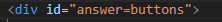

# Online Quiz Game

We are glad to announce that we have the best online quiz in sport domain. The app is running smoothly and is fun to play it.

## User Stories

- As a casual user, I want that the quiz is interactive and easy to play.
- As a regular user, I want the quiz to be chellengeble.

# Futures

## Existing futures:

- A start button for the game.
- A readable question.
- Options to choose.
- A score at the end of the quiz.

## Future futures

- A timer on the top of the quiz.
- Some pictures on the background of each question. 

# Testing

<ul>
<li>I tested that the Quiz works on other browsers: Chrome, Fire Fox, Microsoft Edge.</li>
<li>I can confirm that all the buttons are working.</li>
<li>I have tested the app in devtools and debugging with Visual Code Studio.</li>
</ul>

# Bugs

## Solved bugs

 - I had a problem with the answers on the quiz. The answers cannot be visible. The problem was on the HMTL file with a wrong typping.

 

 # Validator Testing

 <ul>
 <li>HTML </li>
   <ul><li>Using the W3C Validator no errors was found.</li></ul>
 <li>CSS</li>
    <ul><li>Using the W3C Jigsaw validator no errors was found</li></ul>
 <li>JavaScript</li>
    <ul><li>Using the jshint.com validator no errors was found </li></ul>
 <li>Accessibility</li>
    <ul><li>By runnig the lighthouse in devtools fonts and colors are easy to read.     
 </ul>
 

 # Unfixed Bugs
  - No unfixed bugs founded.

  ## Test Cases

  <li>First page</li>
   <ul><li>On the first page i have tested that the "Start Game" button works.</li>
   
       <li>On the footer i have tested all the 3 social medias.</li></ul>
       
   <li>Second Page</li>
   
      <ul>  <li> On the second page i tested the game.
      On the each question if the answer is corret the selected answer will turn green.
      If the answer is wrong the selected answer will turn red.</li>
      <li>At the end of the game i tested the score if it works.</li>
      
      
            

  # Technology:
   - HTML to write the first and second pages.
   - CSS to style the pages.
   - JavaScript to create the quiz.
   - Font Awesome for the social medias

   # Deployment

   ## GitHub
   
   <ul><li>We have deployd the quiz to GutHub.</li>
      <li>On the GitHub pahe head to settings.</li>
      <li>From drop-down menu head to Master Branch.</li>
      <li>After Master Branch was selected it will provide the link to quiz.</ul>

   ## Visual Studio Code

   <ul><li>In the Visul Studio Code we have write the code for the quiz.</li></ul>

  
   # Credits 

<ul>

### Images:
<li>The media images was taken from [Pexels] <https://www.pexels.com/>.</ul>
 
